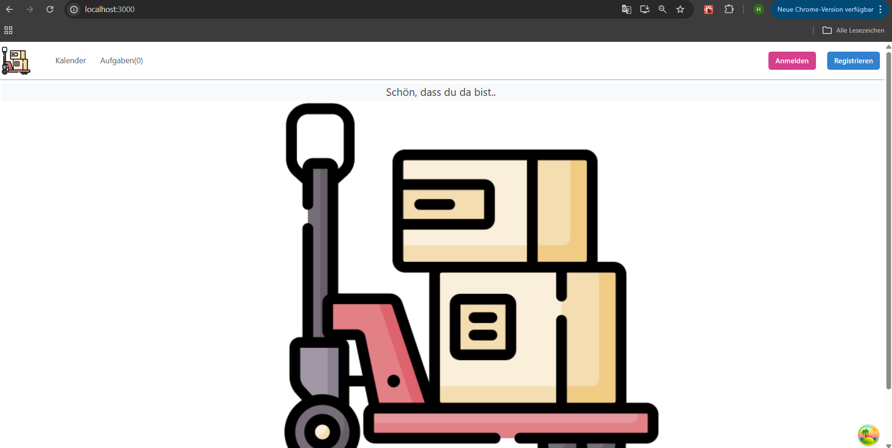
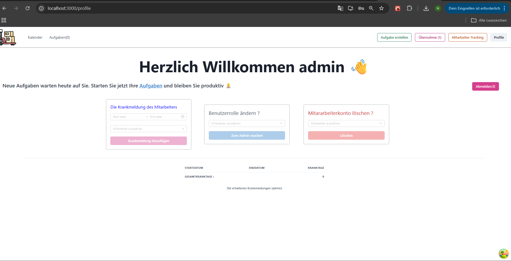
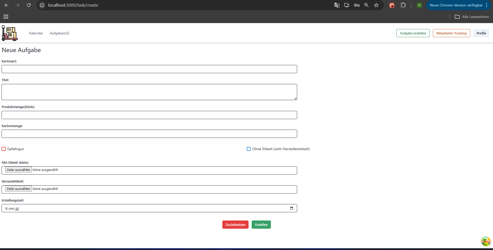
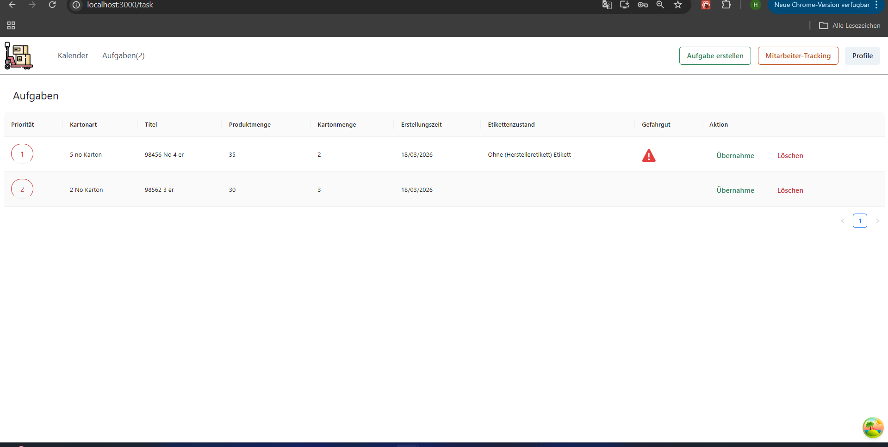
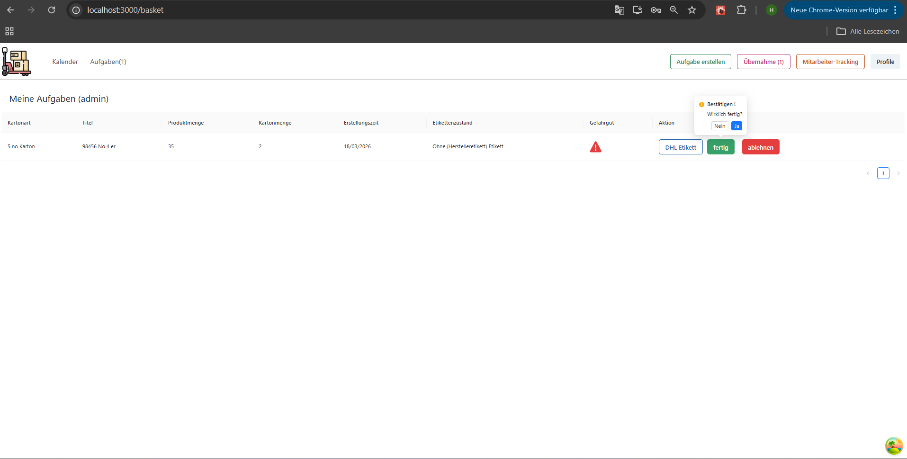
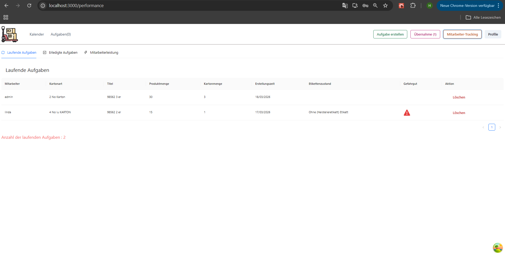
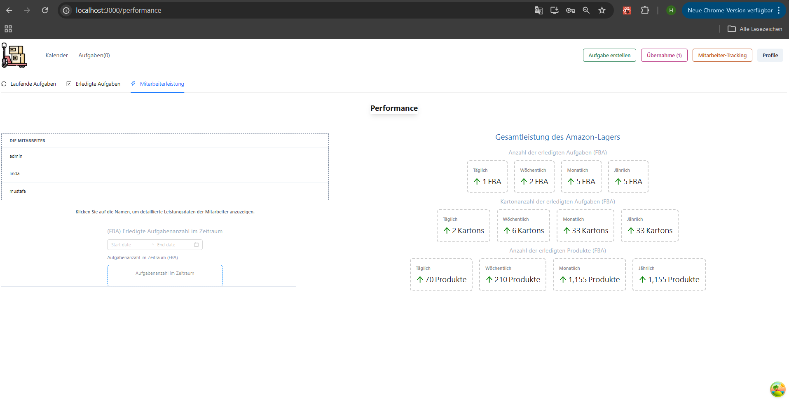
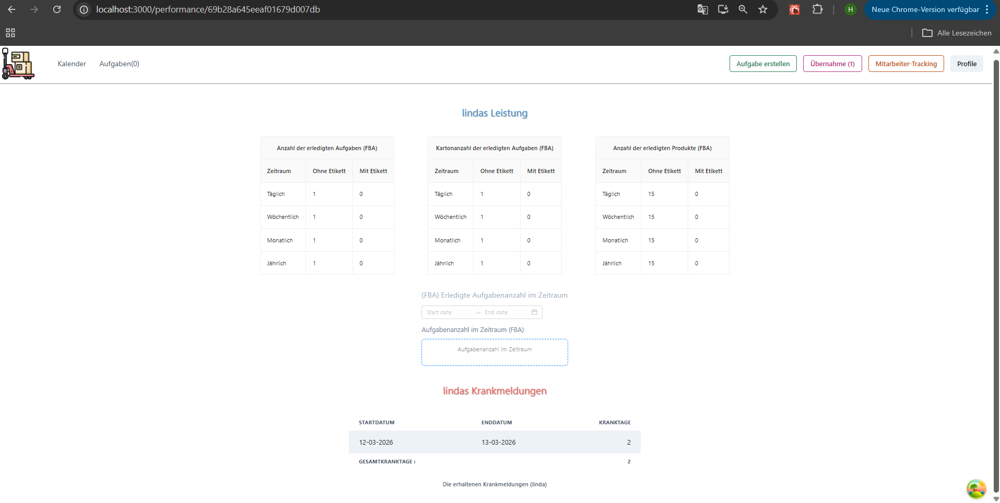

## Screenshots of Web-APP
Ziel = In diesem Web-Aplikation versucht man die Tasken auf Mitarbeiter als übe digital platform zu verteilen. Und nach dem Zeitraum (monatlich, täglich, ...) werden die Leistungen des Lagers und der Mitarbeiter angezeigt. 

The goal is to distribute tasks to employees via a comprehensive digital platform. Warehouse and employee performance will then be monitored over a specific period (monthly, daily, etc.).

### Homepage

### Dashboard of Admin 

### To build a task

### Tasks to review

### Taking over tasks by employee

### The following of Tasks

### The following of performance

### The following performance of employee

